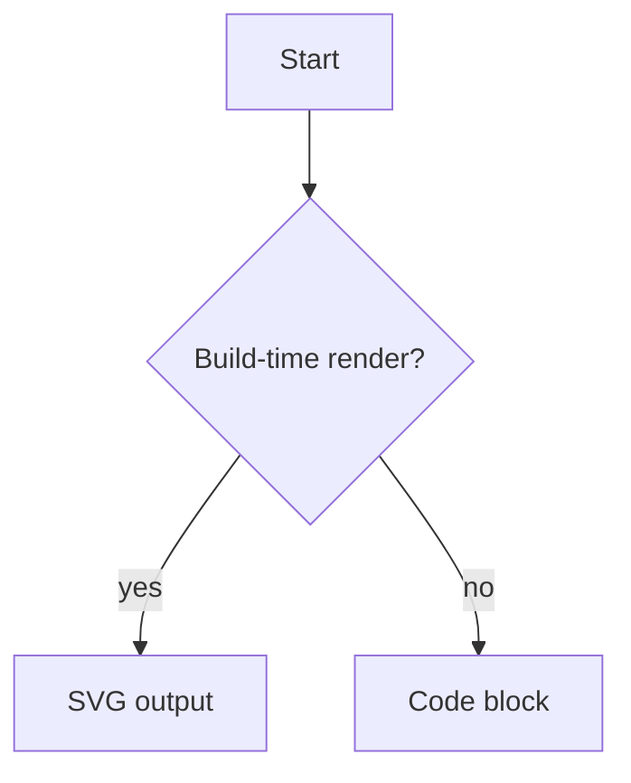

# Personal Blog & Portfolio Website

このプロジェクトは、Astroを使用して構築された個人ブログ＆ポートフォリオウェブサイトです。

## 🌟 特徴

- ブログ機能（Markdown対応）
- プロフィールページ
- コンタクトフォーム
- レスポンシブデザイン
- UnoCSSによるスタイリング
- TypeScriptサポート

## 🚀 技術スタック

- [Astro](https://astro.build/) - 静的サイトジェネレーター
- [TypeScript](https://www.typescriptlang.org/) - 型安全な開発
- [UnoCSS](https://unocss.dev/) - スタイリング
- [date-fns](https://date-fns.org/) - 日付操作
- React（一部コンポーネント）

## 📦 プロジェクト構造

主要なディレクトリとその役割：

```text
/
├── src/
│   ├── assets/      # 画像などの静的アセット
│   ├── components/  # 再利用可能なコンポーネント
│   ├── content/     # ブログ記事のMarkdownファイル
│   ├── layouts/     # ページレイアウト
│   ├── lib/        # ユーティリティ関数とAPI
│   ├── pages/      # ルーティング用ページコンポーネント
│   ├── styles/     # グローバルスタイルとCSS
│   └── types/      # TypeScript型定義
└── public/         # 静的ファイル
```

## 🛠️ セットアップ

1. リポジトリをクローン：

```bash
git clone [repository-url]
```

2. 依存関係をインストール：

```bash
pnpm install
```

3. 環境変数ファイルを作成：

```bash
cp .env.example .env
# 各サービスのIDやエンドポイントを編集
```

4. 開発サーバーを起動：

```bash
pnpm run dev
```

## 📝 コマンド

| コマンド                           | 説明                                                     |
| :--------------------------------- | :------------------------------------------------------- |
| `pnpm install`                     | 依存関係をインストール                                   |
| `pnpm run dev`                     | 開発サーバーを起動（`localhost:4321`）                   |
| `pnpm run build`                   | 本番用ビルドを生成（`./dist/`）                          |
| `pnpm run preview`                 | ビルドしたサイトをプレビュー                             |
| `pnpm run mermaid:install-browser` | Mermaid のビルド時描画に必要な Chromium をローカルへ導入 |

Cloudflare Pages にデプロイする場合は、Build output directory を `dist` に設定してください。

## Mermaid 図のローカル検証

このプロジェクトでは、`mermaid` のコードフェンスを build-time に SVG へ変換します。` ```mermaid ` を書けば常に描画対象になります。

1. Chromium をローカルへ導入

```bash
pnpm run mermaid:install-browser
```

2. その状態で `pnpm run dev` または `pnpm run build` を実行

````md

````

Mermaid は build-time の `img-svg` 戦略で描画され、ダークモード時は `picture` 要素経由でダーク向け SVG が使われます。CI や本番 build でも Mermaid を使う場合は、ローカルと同様に Chromium を導入した状態で build してください。

## 🔄 自動更新

環境構成の詳細は `environment.md` に記載されており、プロジェクトの構造が変更されると自動的に更新されます。

公開リポジトリ向けの環境変数設定とセキュリティチェックは `docs/public-release-checklist.md` を参照してください。

## 📄 ライセンス

このプロジェクトはMITライセンスの下で公開されています。
