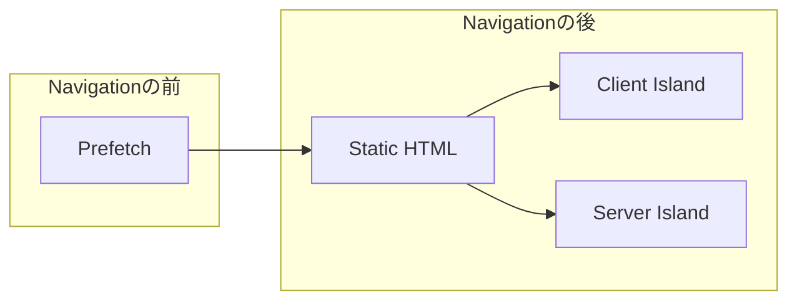
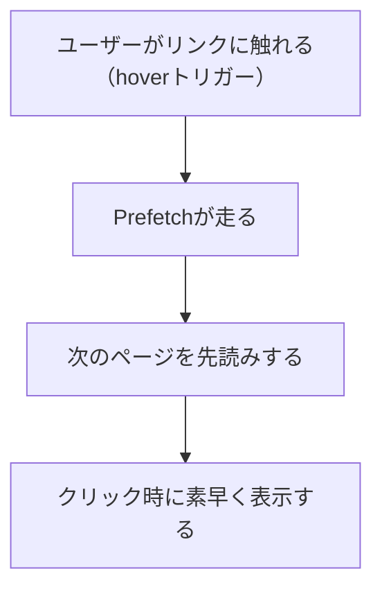

AstroにはPrefetch機能とIslands architectureという仕組みがあります。
「Prefetchは、ユーザーが次に遷移する画面を予測し、先読みする仕組み」
「Islands architectureは、静的HTMLの中に、動的なUIやサーバー処理をIslandとして分離し、それぞれ最適なタイミングで読み込む仕組み」
という感じです。

ここで、1つ疑問が浮かびました。

「**Prefetchを使用する時、PrefetchとIslands architectureは、お互いに関係・干渉しているのか？**」

なんとなく挙動のイメージはつくのですが、整理がてら本記事を書きます。

## 結論の先出し

> 「**Prefetchを使用する時、PrefetchとIslands architectureは、お互いに関係・干渉しているのか？**」

この疑問への答えは、以下の図で表せます。

Prefetchは図の左部分、Islands architectureは図の右部分がそれぞれの担当レイヤーになっています。すなわち、お互いに過度に干渉しているというよりは、機能として担当レイヤーが異なる、ユーザーの体験的には、担当レイヤーは連続している（Prefetch → Island処理）と言えると思います。

さてこの結論を胸に、中身を見ていきましょう。

:::note
Prefetchについてすでに理解を深めていらっしゃる方は、次のセクションではなく、[## Islands architectureとは何か](#islands-architectureとは何か)のセクションへ移動してみてください〜。また、この記事の結論をみたい方は[## PrefetchとIslands architectureを実行フロー順に整理する](#prefetchとislands-architectureを実行フロー順に整理する)のセクションへ遷移してみてください。
:::

## 前提情報 Prefetchとは何か

今回の記事では、PrefetchとIsland Architectureを扱うため、前提情報についてまず触れていきます。
さて、そもそもPrefetchとは何か、

**ユーザーが次に遷移する画面を予測し、先読みする仕組み**

上記の一言と図で表せると思います。

ただ、以下2つの部分にフレームワークやライブラリなどの設計デザイン、いわゆる哲学や思想というものが出るのだと思います。

- どのようにユーザーが遷移する画面の予測をするのか
- どのように先読みするのか

Astroの場合は、基本的にブラウザ標準のAPIを活用するスタンスをとっており、以下あたりが裏側で動いているとイメージしていただければいいと思います。

**ユーザーが遷移する画面予測のトリガー**

AstroのPrefetchでは、ユーザーが「次にそのリンクを選びそうか」を判断するために、`hover` / `tap` / `viewport` / `load`の4つの戦略を選べます。デフォルトは`hover`です。つまり、速さを優先するのか、不要な通信を減らすのかを、開発者がトリガー単位で調整できるわけです。

- `hover`は、リンクにホバーした時やキーボードフォーカスが当たった時に先読みします。実装上も`mouseenter`/`focusin`を起点にし、少し待ってから実行し、離れたらキャンセルするようになっています。
- `tap`は`touchstart` / `mousedown`のタイミングで発火します。クリック直前なので、無駄な先読みをかなり減らしやすいです。
- `viewport`は、リンクがビューポートに入ったときに低優先度で先読みします。裏側では`IntersectionObserver`ベースで監視されています。
- `load`は、ページの読み込み完了後に、そのページ内のリンクを順番に低優先度で先読みします。

この4つを見てわかるように、AstroのPrefetchは「次ページをどう読むか」だけでなく、「どの瞬間をユーザーの遷移意図とみなすか」まで含めて設計されています。

**先読みのロジック**

では、そのトリガーで実際に何をしているのか。Astroはここでもブラウザ標準の仕組みにかなり寄り添っています。通常のPrefetchでは、対応ブラウザなら`<link rel="prefetch">`を使って次ページの文書を先読みし、Safariなど`<link rel="prefetch">`がうまく機能しない場面では`fetch()`にフォールバックします。さらに`prefetch()`APIの仕様上、低速回線やData Saverが有効な環境では無理に先読みしない仕組みになっています。

さらに、`experimental.clientPrerender`を有効にした場合は、「Speculation Rules API」を使って、Prefetchだけでなく、Prerenderまで行うことで、次ページをより積極的に準備します。この時は、いわば既存のPrefetch処理の拡張と言えると思います。

:::note
**Speculation Rules API**  

MDNでも、Speculation Rules APIは文書単位の`prefetch` / `prerender`を扱う仕組みとして説明されており、特に`prerender`はhidden tabでページ自体を準備するため、単にHTMLをキャッシュしておくより一段踏み込んだ先読みです。（なお、これは現時点ではChromium系ブラウザ中心の実験的なサポートです）
:::

つまり、Astroの先読みロジックはざっくり言うと以下のように整理できます。

1. 通常時は`<link rel="prefetch">`を優先する
2. 非対応ブラウザでは`fetch()`にフォールバックする
3. `experimental.clientPrerender`を有効にした環境では Speculation Rules APIを活用する

この「ブラウザ標準を使い、必要な時だけフォールバックする」という姿勢は、Astroの設計思想がかなり表れている部分だと思います。

詳しくは、以前いくつか記事を書きましたので以下をご覧いただけると幸いです！
- [プリフェッチから学ぶWebパフォーマンスの最適化](https://zenn.dev/saku2323/articles/about-prefetch)
- [Astroはなぜ速い？プリフェッチの内部実装を追う](https://zenn.dev/saku2323/articles/about-astro-prefetch)
- [Speculation Rules API から見るブラウザのプリフェッチ戦略](https://zenn.dev/saku2323/articles/about-speculation-api)
- [AstroとNext.jsのPrefetchを比較し、アプローチの違いを整理する](https://saku-space.com/blog/astro-nextjs-prefetch-comparison/)

## Islands architectureとは何か

### 概要

さて、ここからが本題です。Islands architectureとはなんでしょうか。

公式Docsを読めばなんとなく掴めるかと思います。

https://docs.astro.build/ja/concepts/islands/

また、AstroのIslands architectureを理解するにあたり、Zennの記事も有用だと思います。このIslands architectureは、Next.jsのPPRと表面上は似ている為、比較記事も存在します。比較しながら考えることで、理解が深まると思うので添付しておきます。筆者の方々ありがとうございます！

https://zenn.dev/morinokami/articles/islands-architecture-with-astro

https://zenn.dev/akfm/articles/ppr-vs-islands-architecture

https://zenn.dev/morinokami/articles/astro-server-islands-vs-nextjs-ppr

上記を読みつつ、まとめると。Islands architectureとは、

**静的HTMLの中に、必要な動的UIやサーバー処理をIslandとして埋め込む仕組み**

この一言で表せると思います。いや、流石に、こんな単純ではないかもしれません。そもそもこのIslandという概念は、元来Astro発祥ではなく、外から取り入れられたものです。間違ったことは言えないので、以下Astroの公式ドキュメントを引用すると

> 2019年にEtsyのフロントエンドアーキテクトKatie Sylor-Miller氏が初めて提案しました。その後、Preactの創始者Jason Miller氏が2020年8月11日の記事で概念を拡張し、体系立てて紹介しました。

<small>引用：<a href="https://docs.astro.build/ja/concepts/islands/" target="_blank">https://docs.astro.build/ja/concepts/islands/</a></small>

そのため歴史的には、以下の感じです。
1. Katie Sylor-Miller
2. Jason Miller（Preact創始者）

Jason氏が布教した以降は、色々なフレームワークに影響を与えていたり、取り入れられています。ただ布教と言う点でAstroはAstro以降のフレームワークやライブラリにかなり大きな影響を与えていると思います。（Astroが好きなので、私のポジショントーク感は否めませんが...）

### 理解する上で、押さえるべき要点

AstroのIslands architectureを理解する上で、最低限押さえておきたいのは以下の3点です。

1. Astroは、デフォルトでHTML・CSSのみを返す（Island未経由でのJavaScriptの扱いは、[こちらへ](#余談-javascriptをisland経由以外で書いたらどのように扱われるか)）
2. インタラクティブなUIを埋め込みたい場合など、特定の状況下ではIsland経由でハイドレーション[^1]が必要
3. その「Island」には、ブラウザで後からhydrateされるものと、サーバー側で別タイミングに描画されるものがある

Astro自体は、MPA方式のフレームワークで、**Islands architecture**は、**AstroのデフォルトゼロJS**や**他のReactなどUIフレームワークを埋め込める特徴**とともに語られることが多いですが、これら3つの特徴は、お互いに深く関係しあっていると言えると思います。

> 他のReactなどUIフレームワークを埋め込める特徴

の部分をSPA方式でAstroとは異なる思想により機能しているJSコードの塊としてみてみましょう。
あら不思議、3つともJSに関わる技術だと言えると思います。そういう意味で、Astroは非常に**JavaScriptの扱い**にこだわっているように感じますし、Islands architectureは、「どこにJavaScriptが必要か」だけでなく、「いつ実行するか」「どの単位で切り離すか」を考えるための設計でもあるなと感じます。

#### 余談JavaScriptをIsland経由以外で書いたらどのように扱われるか

Astroでは、Islandを使用せずともJavaScriptを書くことができ、仮に`.astro`を使用したプロジェクトの場合、主に以下3通りの書き方があると思います。

- コンポーネントスクリプトの内に書く（.mdなどで言うfrontmatter部分。コードフェンスの内のこと）
- コンポーネントテンプレートで`<script>`タグを使用する
- src配下に`*.ts`または、`*.js`ファイルを作成・配置し、.astroファイル内にて、`<script src>`でインポートする

簡潔に扱いを整理すると以下のような感じですね。

##### ケース1. コンポーネントスクリプトの内に書く

コンポーネントスクリプト内に書いたJavaScriptは、ビルド時またはサーバー描画時に実行されます。HTMLを作るための処理に使われ、ブラウザには送られません。

##### ケース2. コンポーネントテンプレートで`<script>`タグを使用する**

テンプレート内の`<script>`は、クライアントスクリプトとしてブラウザに送られます。DOM操作やイベント処理など、ページ上の振る舞いを書く場所です。

##### ケース3. src配下に`*.ts`または、`*.js`ファイルを作成・配置し、.astroファイル内にて、`<script src>`でインポートする  

`src`配下の`.ts`や`.js`を`<script src>`で読み込んだ場合も、ブラウザで実行されるクライアントスクリプトとして扱われます。テンプレート直書きよりも、再利用しやすかったり、長文のコードの場合はメンテナンスしやすいのが利点です。

### 2種類のIslandがあるよ？

Astroのドキュメントを見ていくと、Islandと一口に言っても役割の違う2つのIslandがあります。

#### Client Island

Client Islandは、インタラクションが必要なUIを、必要なタイミングでだけブラウザ側にhydrateする考え方です。Astroでは、UIフレームワークのコンポーネントも最初はHTMLとして出力され、そのうえで`client:load` / `client:idle` / `client:visible` / `client:media` / `client:only`といったdirectiveに応じて、あとからJavaScriptを読み込んで動き出します。

要するに、Client Islandの関心事は「このUIをブラウザでいつ動かすか」です。ここが、後で出てくるPrefetchとの大きな違いでもあります。

#### Server Island

一方のServer Islandは、動的なコンテンツや重いサーバー処理を、ページ本体とは切り離して後から差し込むための仕組みです。`server:defer`を付けると、Astroはまずページ全体のHTMLを返し、その後で特別なエンドポイントにGETリクエストを送り、Server Islandの中身を別途取得します。`slot="fallback"`を用意しておけば、取得が終わるまでの仮表示も出せます。

つまり、Server Islandの関心事は「この部分をサーバーからいつ返すか」です。Client Islandがブラウザ側のhydrateタイミングを扱うのに対して、Server Islandは**サーバー側のHTMLレスポンスタイミング**を扱う、と捉えると整理しやすいです。

## PrefetchとIslands architectureを実行フロー順に整理する

まず、両者がカバーしている範囲を分けておくとかなり理解しやすくなります。

Prefetchは、**今見ているページから、次に遷移するかもしれないページをどこまで先読みしておくか** という仕組みです。つまり、主に担当しているレイヤーは、「遷移の前」です。

一方Islands architectureは、**遷移した先のページを、どの単位で・どのタイミングで動かすか** を扱う仕組みです。こちらの主戦場は「遷移した後のページ内部」です。

この時点で、両者はどちらも「情報の取得方法を制御する目的」を持ちながらも、基本的には別のレイヤーを担当していることがわかります。

通常のPrefetchを前提にすると、実行フローはだいたい以下の順番で整理できます。

1. 現在のページ上で、Astroがリンクに対して`hover`や`tap`などのトリガーを待っている
2. 条件が揃うと、Astroが次ページの文書を`<link rel="prefetch">`あるいは`fetch()`で先読みする
3. この段階では、まだユーザーは遷移していないので、次ページのClient Islandがhydrateされるわけではない
4. 実際に遷移が起きると、先読み済みの文書を土台に次ページが表示される
5. その後で、次ページ内のClient Islandが`client:*`の条件に従ってhydrateされる
6. `server:defer`を使ったServer Islandがある場合は、fallbackを見せつつ別リクエストで中身が差し込まれる

1・2部分が、Prefetch。4・5・6がIslands architectureの担当レイヤーです。

こうして見ると、通常のPrefetchとIslands architectureは、競合というよりバトンタッチの関係です。Prefetchが「次のページを先に用意する」役割を担い、Islands architectureが「そのページのどこを、いつ、どの環境で動かすか」を担うわけです。

:::note
**`experimental.clientPrerender`を有効にした場合**  

あくまで推測が混じりますが、`experimental.clientPrerender`を有効にした場合はフローが少し変わるのではないか？と思います。Speculation Rules APIの`prerender`が使える環境では、遷移前から次ページ自体を Invisibleなhidden tabで準備（描画・実行）できるため、Client IslandのJavaScript実行や、Server Islandでのデータフェッチなどが遷移前に始まる可能性があるのではないか？と思っています。つまり、**通常のPrefetchでは役割分担がかなり明確だが、client prerenderまで有効にすると両者の実行タイミングは一部重なる**、と整理できるのではないでしょうか？

もし、先に実行できるのであれば使い方によってはユーザー体験を更に向上できるかもしれない反面、開発者が実行タイミングについてもより深く把握しておく必要が出てくるので、その点は気合いでなんとかするしかないかもですね。
:::

## まとめ

今回は、PrefetchというAstroの機能を通して、Islands architectureを観察してみました。
PrefetchとIslands architectureは、どちらもユーザー体験を良くするための仕組みですが、通常は見ているレイヤーが異なります。Prefetchは「遷移前に次ページをどう準備するか」、Islands architectureは「遷移後のページ内をどう分割し、いつ動かすか」を扱っています。

なので、通常のAstro Prefetchでは、両者は干渉するというより、前後の工程を分担していると考えるのが自然です。ただし、`experimental.clientPrerender`でprerenderまで踏み込むと、遷移前から次ページの実行準備が進む可能性があるため、ここで初めてIslands architectureとの重なりが増えるのではないかと思います。

今回の件でIslands architectureについてより深く調査しましたが、以前より更にAstroの特徴として上がる理由がわかった気がします。Islands architectureは、Reactなどを埋め込む、JSハイドレーションの文脈で触れられることが多いですが、違う視点で見てみると、それらの埋め込みなどは、あくまで副産物な気もしました。

今後もいろいろ観察していこうと思います。本記事を読んでいただきありがとうございました。

皆さんもLet's be an Astronaut!

## 参考資料
文中で触れたものも含め、参考にした資料をまとめておきます。

- [プリフェッチから学ぶWebパフォーマンスの最適化](https://zenn.dev/saku2323/articles/about-prefetch)
- [Astroはなぜ速い？プリフェッチの内部実装を追う](https://zenn.dev/saku2323/articles/about-astro-prefetch)
- [Speculation Rules API から見るブラウザのプリフェッチ戦略](https://zenn.dev/saku2323/articles/about-speculation-api)
- [Prefetch | Astro公式Docs](https://docs.astro.build/ja/guides/prefetch/)
- [Experimental client prerendering | Astro公式Docs](https://docs.astro.build/ja/reference/experimental-flags/client-prerender/)
- [Islands | Astro公式Docs](https://docs.astro.build/ja/concepts/islands/)
- [Template directives reference | Astro公式Docs](https://docs.astro.build/ja/reference/directives-reference/)
- [Server islands | Astro公式Docs](https://docs.astro.build/ja/guides/server-islands/)
- [Speculation Rules API | MDN](https://developer.mozilla.org/en-US/docs/Web/API/Speculation_Rules_API)
- [`rel="prefetch"` | MDN](https://developer.mozilla.org/ja/docs/Web/HTML/Reference/Attributes/rel/prefetch)
- [Astro Prefetch tap処理 | GitHubリポジトリ](https://github.com/withastro/astro/blob/main/packages/astro/src/prefetch/index.ts#L57-L69)
- [Astro Prefetch hover処理 | GitHubリポジトリ](https://github.com/withastro/astro/blob/main/packages/astro/src/prefetch/index.ts#L74-L122)
- [Astro Prefetch viewport処理 | GitHubリポジトリ](https://github.com/withastro/astro/blob/main/packages/astro/src/prefetch/index.ts#L127-L174)
- [Astro Prefetch load処理 | GitHubリポジトリ](https://github.com/withastro/astro/blob/main/packages/astro/src/prefetch/index.ts#L179-L188)

[^1]: ハイドレーション（Hydration）とは、サーバー側で生成された静的なHTMLに対して、クライアント側でJavaScriptを適用し、イベントリスナーや状態管理などのインタラクティブな機能を付与するプロセスのこと。「水分を与える（hydrate）」という比喩から、静的なHTMLに動的な振る舞いを"注入"するイメージで名付けられている。
