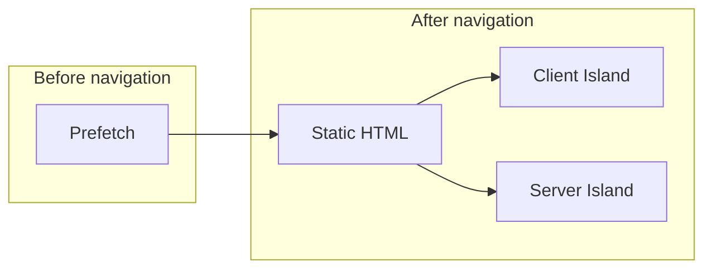
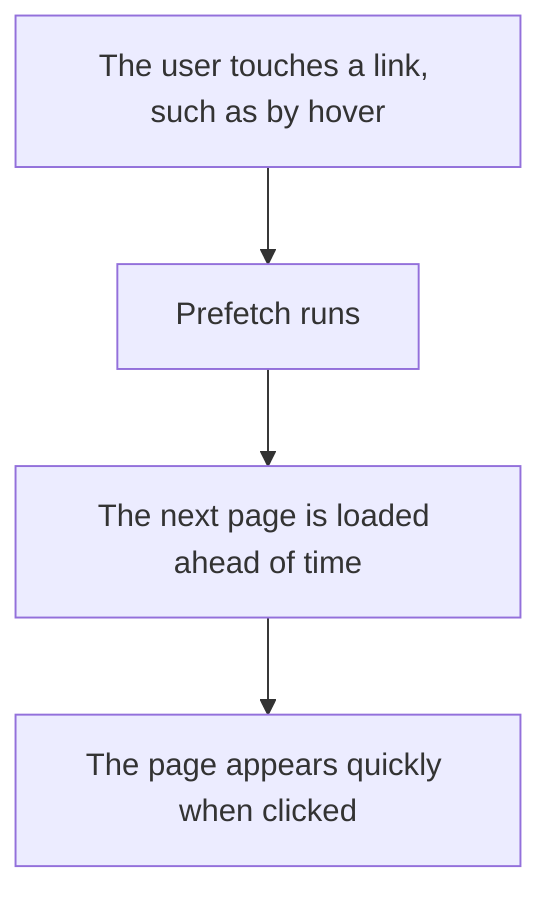

Astro has a feature called Prefetch and an architectural pattern called Islands architecture.

Roughly speaking, Prefetch is a mechanism for predicting the page a user may visit next and loading it ahead of time. Islands architecture is a mechanism for separating dynamic UI and server-side work as "islands" inside otherwise static HTML, then loading each part at an appropriate timing.

While thinking about these two ideas, one question came to mind:

**When using Prefetch, do Prefetch and Islands architecture relate to or interfere with each other?**

I have a rough mental model of how they behave, but I wanted to organize it properly in this article.

## Conclusion First

> **When using Prefetch, do Prefetch and Islands architecture relate to or interfere with each other?**

My current answer can be expressed with this diagram.

Prefetch is responsible for the left side of the diagram, while Islands architecture is responsible for the right side. In other words, I think they do not interfere much with each other. They are responsible for different layers. From the user's point of view, however, those layers are connected as a continuous flow: Prefetch first, then island processing.

With that conclusion in mind, let's look into the details.

:::note
If you already understand Prefetch well, you can skip ahead to [What is Islands architecture?](#what-is-islands-architecture). If you only want the main conclusion, jump to [Organizing Prefetch and Islands architecture by execution flow](#organizing-prefetch-and-islands-architecture-by-execution-flow).
:::

## Prerequisite: What is Prefetch?

Because this article discusses both Prefetch and Islands architecture, let's start with the prerequisite concepts.

So, what is Prefetch?

**It is a mechanism that predicts the page a user may navigate to next and loads it ahead of time.**

I think that sentence and diagram capture the basic idea.

That said, the design philosophy of a framework or library tends to appear in two areas:

- How it predicts which page the user will navigate to
- How it actually performs the ahead-of-time loading

In Astro's case, the basic stance is to use browser-standard APIs where possible. It helps to imagine the following pieces working behind the scenes.

**Triggers for predicting user navigation**

Astro Prefetch lets you choose from four strategies for deciding whether the user is likely to select a link next: `hover`, `tap`, `viewport`, and `load`. The default is `hover`. This means developers can tune the trigger depending on whether they want to prioritize speed or reduce unnecessary network requests.

- `hover` prefetches when the user hovers over a link or when keyboard focus enters it. In the implementation, `mouseenter` and `focusin` are used as starting points. Astro waits briefly before running the prefetch, and cancels it if the user moves away.
- `tap` fires on `touchstart` or `mousedown`. Since this is very close to the click itself, it can reduce unnecessary prefetching.
- `viewport` prefetches at low priority when a link enters the viewport. Under the hood, it is based on `IntersectionObserver`.
- `load` prefetches links on the page one by one, at low priority, after the page has finished loading.

Looking at these four strategies, Astro Prefetch is not only about how to load the next page. It also includes the question of which moment should be treated as the user's navigation intent.

**The loading logic**

So what actually happens once one of those triggers fires? Here too, Astro stays close to browser-standard mechanisms. In normal Prefetch, if the browser supports it, Astro uses `<link rel="prefetch">` to load the next page document ahead of time. In environments where `<link rel="prefetch">` does not work well, such as some Safari cases, Astro falls back to `fetch()`. Also, based on the behavior of the `prefetch()` API, it avoids forcing prefetching on slow connections or when Data Saver is enabled.

If `experimental.clientPrerender` is enabled, Astro uses the Speculation Rules API to go beyond Prefetch and perform Prerender as well, preparing the next page more aggressively. I see this as an extension of the existing Prefetch behavior.

:::note
**Speculation Rules API**

MDN describes the Speculation Rules API as a mechanism for document-level `prefetch` and `prerender`. In particular, `prerender` prepares the page itself in a hidden tab, so it goes one step further than simply caching HTML. At the moment, support is still mainly centered around Chromium-based browsers.
:::

In short, Astro's loading logic can be summarized like this:

1. Under normal conditions, prioritize `<link rel="prefetch">`
2. Fall back to `fetch()` in unsupported browsers
3. Use the Speculation Rules API when `experimental.clientPrerender` is enabled

This posture of using browser standards and only falling back when needed feels very representative of Astro's design philosophy.

I have written a few related articles before, so please take a look if you want more detail.

- [プリフェッチから学ぶWebパフォーマンスの最適化](https://zenn.dev/saku2323/articles/about-prefetch)
- [Astroはなぜ速い？プリフェッチの内部実装を追う](https://zenn.dev/saku2323/articles/about-astro-prefetch)
- [Speculation Rules API から見るブラウザのプリフェッチ戦略](https://zenn.dev/saku2323/articles/about-speculation-api)
- [AstroとNext.jsのPrefetchを比較し、アプローチの違いを整理する](https://saku-space.com/blog/astro-nextjs-prefetch-comparison/)

## What is Islands Architecture?

### Overview

Now we get to the main topic. What is Islands architecture?

You can get a rough understanding by reading the official Astro docs.

https://docs.astro.build/en/concepts/islands/

There are also useful Zenn articles for understanding Astro's Islands architecture. Since Islands architecture can look similar to Next.js PPR on the surface, comparison articles are also helpful. Reading them side by side can deepen the mental model, so I will include them here. Thank you to the authors.

https://zenn.dev/morinokami/articles/islands-architecture-with-astro

https://zenn.dev/akfm/articles/ppr-vs-islands-architecture

https://zenn.dev/morinokami/articles/astro-server-islands-vs-nextjs-ppr

After reading these, I would summarize Islands architecture like this:

**A mechanism for embedding only the necessary dynamic UI and server-side processing as islands inside static HTML.**

Of course, that may be too simple. The island concept did not originally come from Astro. Since I do not want to say something inaccurate here, I will refer to the official Astro documentation:

> The term "component island" was first coined by Etsy's frontend architect Katie Sylor-Miller in 2019. Preact creator Jason Miller later expanded and popularized the idea in 2020.

<small>Source: <a href="https://docs.astro.build/en/concepts/islands/" target="_blank">https://docs.astro.build/en/concepts/islands/</a></small>

Historically, the rough flow is:

1. Katie Sylor-Miller
2. Jason Miller, creator of Preact

After Jason Miller popularized the idea, it influenced many frameworks and libraries. In terms of popularizing the concept, I think Astro has had a major influence on frameworks and libraries that came after it. I like Astro, so this may be a slightly biased take.

### Key Points to Understand

To understand Astro's Islands architecture, I think there are at least three points to keep in mind:

1. Astro returns HTML and CSS by default. For JavaScript that does not go through an island, see [A side note: what happens when you write JavaScript outside islands?](#a-side-note-what-happens-when-you-write-javascript-outside-islands)
2. In certain cases, such as when embedding interactive UI, hydration[^1] through an island is needed
3. There are two kinds of islands: ones hydrated later in the browser, and ones rendered on the server at a separate timing

Astro itself is an MPA-style framework. Islands architecture is often discussed together with Astro's default zero-JS approach and its ability to embed UI frameworks such as React. I think these three characteristics are deeply connected.

Let's look at the ability to embed UI frameworks such as React as a bundle of JavaScript code that works with a different philosophy from Astro's MPA approach.

Then it becomes clear that all three are related to JavaScript. In that sense, Astro feels very intentional about how JavaScript is handled. Islands architecture is not only about where JavaScript is needed. It is also a way to think about when JavaScript runs and what unit it should be separated into.

#### A Side Note: What Happens When You Write JavaScript Outside Islands?

In Astro, you can write JavaScript without using islands. If you are working with `.astro` files, there are mainly three ways to write it:

- Write it inside the component script, which is the frontmatter-like part inside the code fence
- Use a `<script>` tag in the component template
- Create a `*.ts` or `*.js` file under `src`, then import it with `<script src>` inside an `.astro` file

Briefly, each case is handled like this.

##### Case 1: Writing JavaScript Inside the Component Script

JavaScript written inside the component script runs at build time or during server rendering. It is used to create HTML and is not sent to the browser.

##### Case 2: Using a `<script>` Tag in the Component Template

A `<script>` in the template is sent to the browser as a client script. This is where you write page behavior such as DOM manipulation or event handling.

##### Case 3: Creating a `*.ts` or `*.js` File Under `src` and Importing it with `<script src>`

When a `.ts` or `.js` file under `src` is loaded with `<script src>`, it is also treated as a client script that runs in the browser. Compared with writing directly in the template, this can be easier to reuse and maintain, especially when the code gets longer.

### There Are Two Kinds of Islands

Looking through the Astro documentation, there are two kinds of islands with different roles.

#### Client Island

A Client Island is the idea of hydrating interactive UI in the browser only when needed. In Astro, UI framework components are first output as HTML. Then, depending on directives such as `client:load`, `client:idle`, `client:visible`, `client:media`, and `client:only`, JavaScript is loaded later and the component becomes interactive.

In short, the concern of a Client Island is: **when should this UI run in the browser?** This is also one of the big differences from Prefetch, which will appear later.

#### Server Island

A Server Island, on the other hand, is a mechanism for separating dynamic content or heavy server work from the main page and inserting it later. When `server:defer` is used, Astro first returns the HTML for the whole page, then sends a GET request to a special endpoint and fetches the Server Island content separately. If you provide a `slot="fallback"`, you can show temporary content until the real content is ready.

In other words, the concern of a Server Island is: **when should this part be returned from the server?** Client Islands handle browser-side hydration timing, while Server Islands handle server-side HTML response timing. I think this distinction makes the model easier to understand.

## Organizing Prefetch and Islands Architecture by Execution Flow

First, it becomes much easier to understand if we separate the areas covered by each concept.

Prefetch is about **how far the current page should prepare a page the user may navigate to next**. Its main layer is before navigation.

Islands architecture is about **which parts of the destination page should run, in what units, and at what timing**. Its main area of responsibility is inside the page after navigation.

At this point, we can see that both mechanisms control how information is fetched or prepared, but they basically own different layers.

Assuming normal Prefetch, the execution flow can be organized roughly like this:

1. On the current page, Astro waits for triggers such as `hover` or `tap` on links
2. When the conditions are met, Astro prefetches the next page document using `<link rel="prefetch">` or `fetch()`
3. At this stage, the user has not navigated yet, so the Client Islands on the next page are not hydrated
4. When navigation actually happens, the next page is displayed using the prefetched document as a base
5. After that, the Client Islands inside the next page hydrate according to their `client:*` conditions
6. If there is a Server Island using `server:defer`, its content is inserted through a separate request while the fallback is shown

Steps 1 and 2 are the Prefetch layer. Steps 4, 5, and 6 are the Islands architecture layer.

Viewed this way, standard Prefetch and Islands architecture are less like competing mechanisms and more like a handoff. Prefetch prepares the next page in advance, while Islands architecture determines which parts of that page run, when they run, and in what environment.

:::note
**When `experimental.clientPrerender` is enabled**

This involves some speculation, but I believe the flow may change slightly when `experimental.clientPrerender` is enabled. In environments where the Speculation Rules API's `prerender` is available, the next page itself can be prepared in an invisible, hidden tab before navigation. This means that Client Island JavaScript execution or Server Island data fetching could potentially begin before the user actually navigates. In other words, **standard Prefetch keeps the responsibilities fairly clear, but once client prerendering is enabled, the execution timings of Prefetch and Islands architecture may overlap more**.

If that kind of earlier execution is possible, it could improve user experience depending on how it is used. At the same time, developers would need to understand execution timing more deeply. That part may require a bit of extra care and determination.
:::

## Summary

In this article, I observed Islands architecture through the lens of Astro Prefetch.

Prefetch and Islands architecture are both mechanisms for improving user experience, but under normal conditions they look at different layers. Prefetch handles how the next page is prepared before navigation. Islands architecture handles how the destination page is divided and when each part runs after navigation.

So in normal Astro Prefetch, I think it is natural to see the two as sharing consecutive phases rather than interfering with each other. However, if `experimental.clientPrerender` goes as far as prerendering, preparation for executing the next page may begin before navigation. That is where the overlap with Islands architecture may start to increase.

Writing this article made me investigate Islands architecture more deeply, and I feel I understand better why it is often raised as one of Astro's defining characteristics. Islands architecture is often discussed in the context of embedding React or hydration, but from another angle, those integrations may be closer to byproducts.

I want to keep observing these kinds of details. Thank you for reading.

Let's be an Astronaut!

## References

Here are the resources I referred to, including the ones mentioned in the article.

- [プリフェッチから学ぶWebパフォーマンスの最適化](https://zenn.dev/saku2323/articles/about-prefetch)
- [Astroはなぜ速い？プリフェッチの内部実装を追う](https://zenn.dev/saku2323/articles/about-astro-prefetch)
- [Speculation Rules API から見るブラウザのプリフェッチ戦略](https://zenn.dev/saku2323/articles/about-speculation-api)
- [Prefetch | Astro Docs](https://docs.astro.build/en/guides/prefetch/)
- [Experimental client prerendering | Astro Docs](https://docs.astro.build/en/reference/experimental-flags/client-prerender/)
- [Islands | Astro Docs](https://docs.astro.build/en/concepts/islands/)
- [Template directives reference | Astro Docs](https://docs.astro.build/en/reference/directives-reference/)
- [Server islands | Astro Docs](https://docs.astro.build/en/guides/server-islands/)
- [Speculation Rules API | MDN](https://developer.mozilla.org/en-US/docs/Web/API/Speculation_Rules_API)
- [`rel="prefetch"` | MDN](https://developer.mozilla.org/en-US/docs/Web/HTML/Reference/Attributes/rel/prefetch)
- [Astro Prefetch tap logic | GitHub repository](https://github.com/withastro/astro/blob/main/packages/astro/src/prefetch/index.ts#L57-L69)
- [Astro Prefetch hover logic | GitHub repository](https://github.com/withastro/astro/blob/main/packages/astro/src/prefetch/index.ts#L74-L122)
- [Astro Prefetch viewport logic | GitHub repository](https://github.com/withastro/astro/blob/main/packages/astro/src/prefetch/index.ts#L127-L174)
- [Astro Prefetch load logic | GitHub repository](https://github.com/withastro/astro/blob/main/packages/astro/src/prefetch/index.ts#L179-L188)

[^1]: Hydration is the process of applying JavaScript on the client side to static HTML generated on the server, adding interactive behavior such as event listeners and state management. The metaphor comes from the idea of "hydrating" static HTML by injecting dynamic behavior into it.
