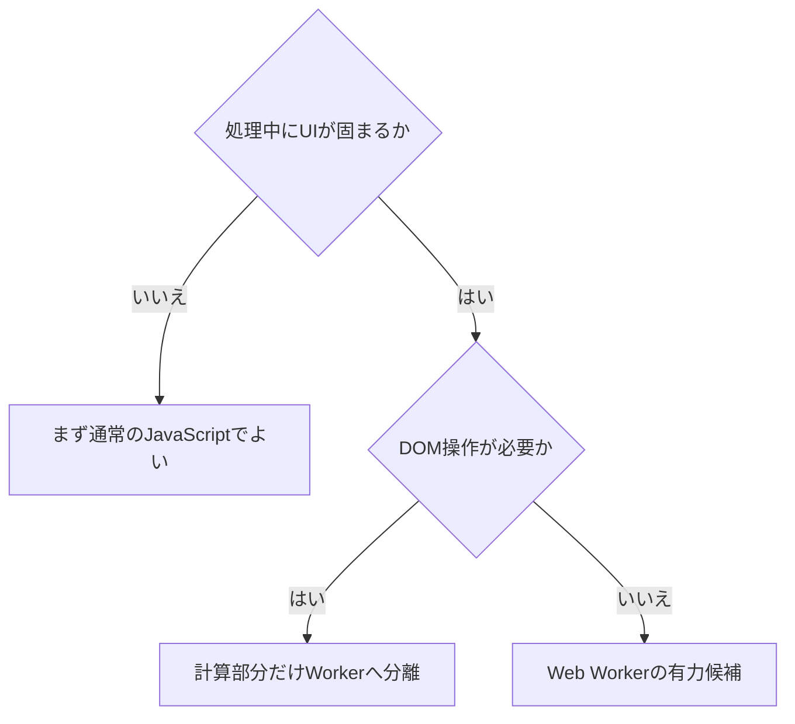
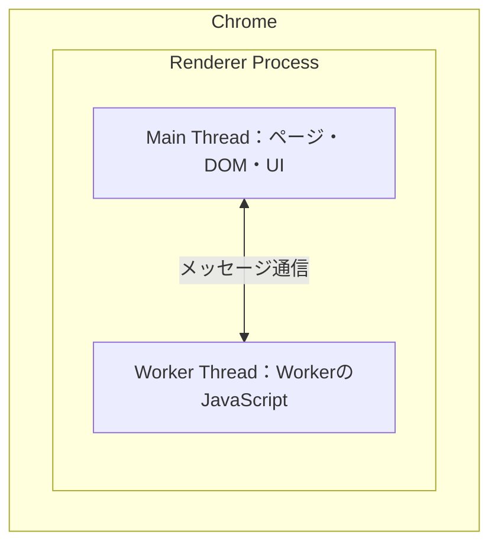

Web Workerについて理解した内容を簡単にまとめます。

## Web Workerとは

Web Workerは、基本的にUIを動かすJavaScriptとは別の実行環境で、重い処理をさせる仕組みです。

JavaScriptは基本的にシングルスレッドで動きます。そのため、重い処理や複数の処理でメインスレッドが占有されると画面が重くなり、場合によっては止まる可能性があります。

`await`などを使えば、処理をいつ再開するか、どの順番で実行するかなどを扱えます。ただし、CPUを使うJavaScriptの処理は、基本的にメインスレッドの中で実行されます。

そこでWeb Workerを使うと、重い処理を別の実行環境へ移し、メインスレッドの占有を防げます。

## Web Workerは万能ではない

ただし、Web Workerは決して万能ではありません。

Worker自体の起動、メインスレッドとの通信、データの複製、Worker用の別バンドルなど、利用するためのトレードオフがあります。

JavaScriptからWorkerへデータを渡す際も、基本的には同じ値をそのまま同期、共有するわけではありません。複製されたデータがWorkerへ渡ります。

これらを加味しても有り余るほど重い処理をさせたい場合は、Web Workerを使うのもありです。

## Web WorkerからDOM操作はできない

ちなみに注意点として、Web Workerから直接DOM操作はできません。通常の`window`とは別の実行環境で動いているためです。

そのため、DOMなど従来のUI操作はメインスレッド側のJavaScriptに任せます。ただ単に重い計算や解析など、UIから切り離せるものをWorkerへ任せるのがよいと思います。

## Workerにはいくつか種類がある

一般的にWeb Workerと言う場合は、Dedicated Workerを指すことが多いです。

HTMLの仕様ではShared Workerも定義されています。また、Service Workerも別のライフサイクルを持つ仕組みとして存在します。

単純にページ内の重い処理を別の場所へ移したい場合は、Dedicated Workerが基本的な選択肢になります。

## 使用するかどうかの判断基準

## Web Workerはどこに作られているのか

Web WorkerはJavaScriptで作られたライブラリではなく、HTML Standardで定義され、各ブラウザに実装されている機能です。

ブラウザ内部の実装には主にC++などが使われています。一方、Workerで動かす私たちのコードはJavaScriptです。TypeScriptの場合はビルド後のJavaScriptが動き、JavaScriptからWebAssemblyを呼び出すこともできます。

「別の実行環境」は、仕様上、特定のOSスレッドと必ず1対1で対応するという意味ではありません。メインページとは別の実行環境とイベントループで動く、と理解するのがよさそうです。

ChromeのDedicated Workerでは、起動元のページと同じRenderer Process内にWorker Threadが作られます。

Web Workerの仕様については、[HTML StandardのWeb Workers](https://html.spec.whatwg.org/multipage/workers.html)で確認できます。Chrome内部のイメージについては、Chromiumの[WorkerとWorkletの実装資料](https://chromium.googlesource.com/chromium/src/+/main/third_party/blink/renderer/core/workers/README.md)を参考にしました。
