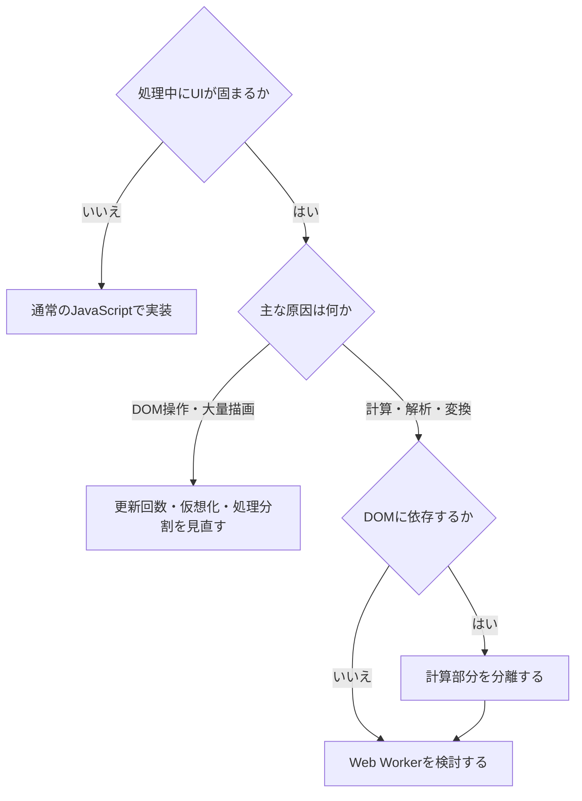
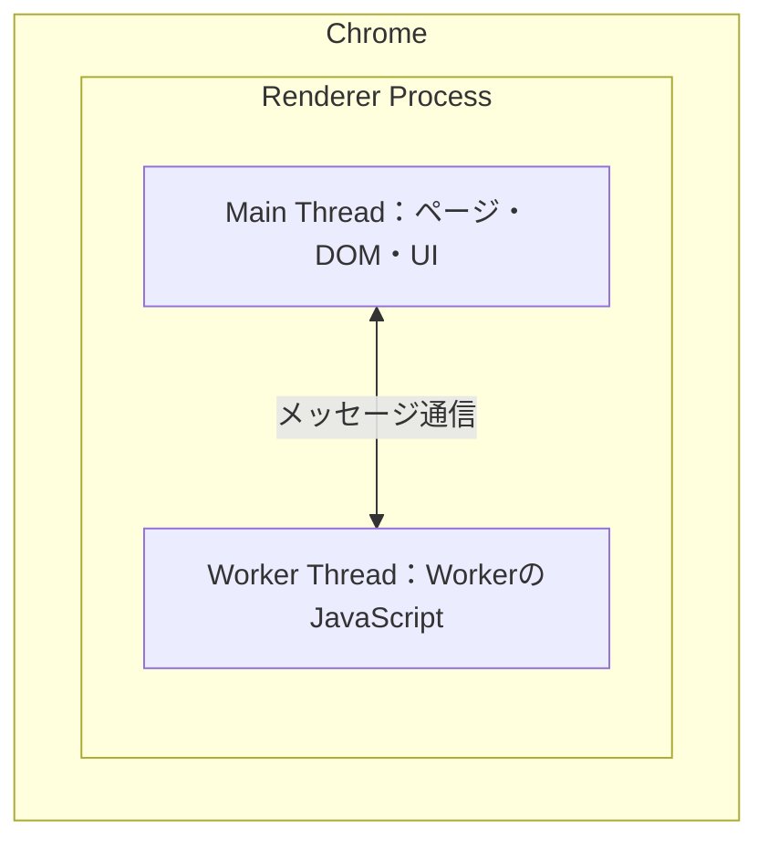

Web Workerは、Webページを動かすJavaScriptとは別の実行環境で処理を実行するための仕組みです。画像や大量データの解析、複雑な計算などをWorkerへ移すことで、メインスレッドが長時間占有されるのを避けられます。

この記事では、Web Workerが必要になる理由から、メインスレッドとの通信方法、ブラウザ内部での実装までを整理します。

## Web Workerが必要になる理由

JavaScriptのコードは、1つの実行環境の中では基本的に一度に1つずつ処理されます。Webページでは、JavaScriptの実行だけでなく、ユーザーの入力、スクロール、DOMの更新、画面の描画など、多くの仕事をメインスレッドが担っています。

このメインスレッドで長時間かかる同期処理を実行すると、その間はほかの仕事が待たされます。クリックしても反応しない、スクロールやアニメーションが引っかかる、画面が止まったように見える、といった状態が起こるのはこのためです。

Web Workerを使うと、DOMから切り離せる計算や解析を、メインページとは別のWorker実行環境へ移せます。メインスレッドはUIに関する仕事を続けられるため、処理中も画面の応答性を保ちやすくなります。

ただし、「JavaScriptはシングルスレッドである」という説明だけでブラウザ全体を捉えると、少し不正確です。ブラウザ自体は複数のプロセスとスレッドを使って動いています。ここでは、1つのJavaScript実行環境では処理が順番に実行される一方、Web Workerを使えば別の実行環境を追加できる、と理解するのがよいでしょう。

## Promiseやawaitだけでは、重い計算の実行場所は変わらない

Promiseや`await`は、非同期処理の完了を待ち、その後の処理順序を扱いやすくする仕組みです。通信やタイマーなどの待ち時間に、メインスレッドを無駄に止めないためには役立ちます。

一方で、CPU負荷の高いJavaScriptの計算を`async`関数に入れ、手前に`await`を書くだけでは、その計算が自動的にメインスレッドの外へ移るわけではありません。計算そのものがメインスレッドで実行されるなら、その実行中はUIも待たされます。

Web WorkerとPromiseは、解決する問題が異なります。Promiseや`await`は主に処理の待機と順序を扱い、Web Workerは処理を別の実行環境へ分けます。

## メインスレッドとWorkerはメッセージでやり取りする

一般的にWeb Workerと呼ぶ場合は、1つのページから起動し、そのページと通信するDedicated Workerを指すことが多いです。

メインスレッドとWorkerは、`postMessage()`でデータを送り、`message`イベントで結果を受け取ります。次の例では、メインスレッドから数値の配列を送り、Workerで合計を計算しています。

```js
// main.js
const worker = new Worker(new URL("./worker.js", import.meta.url), {
  type: "module",
});

worker.postMessage({ values: [10, 20, 30] });

worker.addEventListener("message", (event) => {
  const { total } = event.data;
  document.querySelector("#result").textContent = String(total);
});
```

```js
// worker.js
self.addEventListener("message", (event) => {
  const { values } = event.data;
  const total = values.reduce((sum, value) => sum + value, 0);

  self.postMessage({ total });
});
```

この構成では、Workerが計算を担当し、DOMへの反映はメインスレッドが担当します。実際にWorkerを使う価値が出るのは、合計の計算よりも十分に重い処理を扱う場合です。


## WorkerからDOMを直接操作できない理由

メインページのJavaScriptは、グローバルオブジェクトとして`Window`を持ち、`window`や`document`を通してDOMを操作できます。

一方、Workerは`Window`ではなく`WorkerGlobalScope`を基盤とする実行環境を持ちます。Worker内には通常の`window`や`document`が存在しないため、DOMを直接読み書きできません。

この制約があることで、UIと計算処理の役割を分離しやすくなります。DOM操作や画面更新はメインスレッドに残し、データの集計、検索、解析、変換、圧縮といったDOMに依存しない処理をWorkerへ任せるのが基本です。処理がDOMへ依存している場合は、計算部分だけを純粋な関数として切り出せないかを先に考えます。

## データは同じオブジェクトを共有しているわけではない

メインスレッドとWorkerの間で渡すデータは、通常、構造化クローンの仕組みで複製されます。オブジェクト、配列、Mapなど多くの値を送れますが、送り手と受け手が同じJavaScriptオブジェクトを直接共有しているわけではありません。

大きなデータを何度も複製すると、通信時間やメモリ使用量を無視できなくなることがあります。その場合、`ArrayBuffer`などはTransferableとして渡せます。Transferableでは内部データの所有権が受信側へ移り、送信側のバッファーは切り離されます。

```js
worker.postMessage({ buffer }, [buffer]);
```

さらに、必要なセキュリティ条件を満たすページでは、`SharedArrayBuffer`を使ってメモリを共有する方法もあります。ただし、共有メモリでは複数の実行環境が同じデータへアクセスするため、`Atomics`を含めた同期の設計が必要です。まずは通常のメッセージ通信やTransferableで足りるかを確認する方が扱いやすいでしょう。

## Web Workerにもコストがある

Web Workerを使えば、どのような処理でも速くなるわけではありません。Workerの起動、スクリプトの読み込みと実行準備、メッセージ通信、データの複製や転送にはコストがかかります。Worker用のファイル、エラー処理、終了処理を管理する分、コードも複雑になります。

短時間で終わる軽い処理を毎回新しいWorkerへ渡すと、準備と通信のコストが処理自体を上回る可能性もあります。Workerを採用する場合は、細かい処理を大量に往復させるのではなく、ある程度まとまった単位で処理を渡し、必要に応じてWorkerを再利用する設計が向いています。

## Web Workerを使うかどうかの判断

判断の起点は、処理の重さではなく、UIの応答性を実際に損ねているかどうかです。パフォーマンス計測によって長いタスクを特定し、原因が描画とJavaScriptの計算のどちらにあるのか切り分けます。



DOM操作や大量描画が原因なら、Workerへ移す前にDOMの更新回数、リストの仮想化、処理の分割などを見直します。計算や解析が原因で、その処理がDOMへ依存していないなら、Web Workerが有力な選択肢になります。

## Dedicated Worker、Shared Worker、Service Workerの違い

HTML Standardには、Dedicated WorkerとShared Workerが定義されています。Dedicated Workerは、基本的に起動元となる1つの実行環境と結びついて動きます。Shared Workerは、同一オリジンの複数のWindowやWorkerから接続して共有できます。

Worker系の仕組みとしてはService Workerもありますが、Dedicated Workerとは目的やライフサイクルが異なります。Service Workerはページとは独立したライフサイクルを持ち、ネットワーク通信の制御、キャッシュ、オフライン対応、プッシュ通知などに使われます。単にページ内の重い計算を逃がしたい場合は、まずDedicated Workerを検討します。

## Web Workerは何の言語で、どこに作られているのか

Web Workerを「何の言語で作られた機能か」と考えるときは、仕様、ブラウザの実装、Workerで動かすアプリケーションコードの3つを分けると理解しやすくなります。

| 層                        | 実体                                                                                                    |
| ------------------------- | ------------------------------------------------------------------------------------------------------- |
| Webプラットフォームの仕様 | HTML Standardに記載された文章、アルゴリズム、Web IDL                                                    |
| ブラウザ内部の実装        | Chromium、Firefox、WebKitなどが持つブラウザ固有の実装。C++やRustなどが使われる                          |
| Workerで動かすコード      | JavaScript。TypeScriptはビルド後のJavaScriptとして動く。JavaScriptからWebAssemblyを利用することもできる |

つまり、Web WorkerはJavaScriptで作られたライブラリではなく、Webプラットフォームの仕様に基づいて各ブラウザが提供している機能です。私たちはブラウザが公開するAPIをJavaScriptから利用します。

## 「別の実行環境」と「別のOSスレッド」は同じ意味ではない

仕様を理解するときは、Web Workerを「メインページとは別のagentとWorker用イベントループで動く実行環境」と捉えるのが安全です。Web標準は、ブラウザが内部でどのクラスを使い、OSのスレッドをどう割り当てるかまで一律には定めていません。

実際の構成はブラウザごとに異なります。現在のChromiumでは、Dedicated Workerは起動元のDocumentと同じRenderer Process内でWorker Threadを使って動作します。メインスレッドとWorker Threadの間は、Chromium内部のプロキシを介して連携します。



この図はChromiumの現在の実装を単純化したイメージであり、Web Workerの仕様そのものではありません。ブラウザの内部実装は将来変わる可能性があります。

## まとめ

Web Workerは、DOMから切り離せる重い計算をメインスレッドとは別の実行環境へ移し、UIの応答性を保つための仕組みです。Promiseや`await`と異なり、計算の実行場所そのものを分けられます。

一方で、Workerの起動やデータ通信にはコストがあり、DOMを直接操作できません。まず計測によってボトルネックを特定し、原因がDOMに依存しない計算、解析、変換であると分かってから採用するのが基本です。

Web Workerを「とりあえず処理を速くする機能」ではなく、「メインスレッドがUIへ集中できるように役割を分ける仕組み」と捉えると、使いどころを判断しやすくなります。

この記事では、[HTML StandardのWeb Workers](https://html.spec.whatwg.org/multipage/workers.html)と[構造化データの仕様](https://html.spec.whatwg.org/multipage/structured-data.html)、Chromiumの[WorkerとWorkletの実装資料](https://chromium.googlesource.com/chromium/src/+/main/third_party/blink/renderer/core/workers/README.md)と[スレッド・タスクの資料](https://chromium.googlesource.com/chromium/src/+/HEAD/docs/threading_and_tasks.md)を参考にしました。
